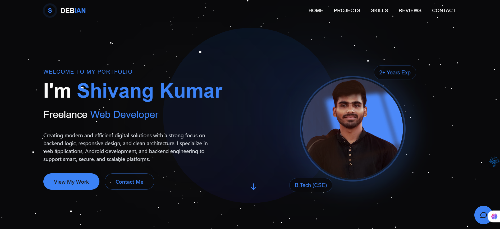

<p align="center">
  
</p>

<h1 align="center">🚀 iamshivang — Full Stack Personal Portfolio</h1>

<p align="center">
  <i>A blazing-fast modern developer portfolio, built with Vite, TypeScript, Drizzle ORM & Tailwind CSS.</i>
</p>

<p align="center">
  <a href="https://github.com/ShivangKumar12/iamshivang/stargazers">
    
  </a>
  <a href="https://github.com/ShivangKumar12/iamshivang/network/members">
    
  </a>
  <a href="https://iamshivang.netlify.app/">
    
  </a>
</p>

<p align="center">
  <a href="https://github.com/ShivangKumar12"></a>
  <a href="https://linkedin.com/in/iamshivang"></a>
  <a href="mailto:shivangkumar.tech@gmail.com"></a>
</p>

---

## 🎬 Preview




---

## 🌟 Features

- ⚡ Blazing fast Vite-powered frontend
- 🎨 Fully responsive and accessible UI with Tailwind CSS
- 💼 Dynamic project & skill management system
- 🔐 Secure backend APIs (Node.js + TypeScript)
- 🧠 Type-safe ORM with Drizzle + PostgreSQL
- 🚀 Netlify deployment-ready
- 🔁 Shared client/server types for consistency

---

## 🗂️ Project Structure

```
.
├── client/         # Frontend (React/Vite)
├── server/         # Backend (APIs, DB logic)
├── shared/         # Shared utilities/types
├── functions/      # Serverless functions
├── public/         # Static assets (images, favicon, etc.)
├── .env            # Environment config
├── netlify.toml    # Netlify deployment config
```

---

## 🛠️ Tech Stack

| Layer         | Technology                     |
|---------------|--------------------------------|
| Frontend      | TypeScript, React, Vite        |
| Backend       | Node.js, TypeScript            |
| ORM/Database  | Drizzle ORM, PostgreSQL        |
| Styling       | Tailwind CSS, PostCSS          |
| Deployment    | Netlify                        |
| Build Tools   | esbuild, Vite                  |

---

## 🚀 Getting Started

### 1. Clone the Repository

```bash
git clone https://github.com/ShivangKumar12/iamshivang.git
cd iamshivang
```

### 2. Install Dependencies

```bash
npm install
```

### 3. Set Environment Variables

Create a `.env` file in the root:

```env
DATABASE_URL=your_postgres_connection_string
# Add other environment-specific variables as needed
```

### 4. Run the App

```bash
npm run dev
```

Visit [http://localhost:3000](http://localhost:3000)

---

## 📦 Deployment (Netlify)

This project is configured for deployment on **Netlify**.

### Steps:

1. Push the repo to GitHub  
2. Connect the repo on [Netlify](https://netlify.com)  
3. Add required environment variables  
4. Trigger a build and deploy 🚀

---

## 🧪 Testing (Coming Soon)

- ✅ Unit tests with **Jest**
- 🚀 End-to-end testing with **Cypress** or **Playwright**

---

## 👨‍💻 About Me

**Shivang Kumar**  
🎓 2nd Year B.Tech CSE Student, Chandigarh Engineering College  
💼 Passionate about full-stack dev, web security & open source

📫 Connect with me:

- [GitHub](https://github.com/ShivangKumar12)
- [LinkedIn](https://linkedin.com/in/iamshivang)
- 📧 [shivangkumar.tech@gmail.com](mailto:shivangkumar.tech@gmail.com)

---

## 🤝 Contributing

Pull requests are welcome! For major changes, open an issue first to discuss the proposal.

```bash
# Fork the repo

# Create a new branch
git checkout -b feature/YourFeature

# Make your changes
git commit -m "Add YourFeature"

# Push to your fork
git push origin feature/YourFeature

# Open a Pull Request 🎉
```

---

## 🪪 License

This project is licensed under the **MIT License**.  
See the [LICENSE](LICENSE) file for details.

---

## 💬 Feedback

If you find a bug or have a feature request, feel free to [open an issue](https://github.com/ShivangKumar12/iamshivang/issues) or reach out to me directly.

---

⭐ **If you like this project, give it a star!**  
